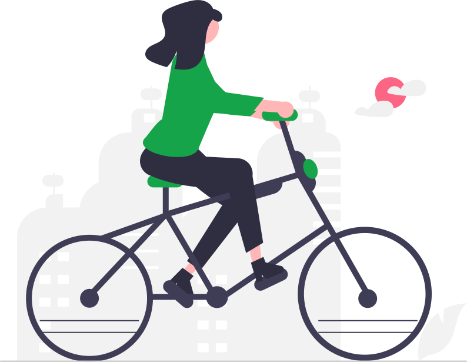

<h1 align="center">
    ⚡ Electrium Mobility Discord Bot ⚡
</h1>



# 💪 Contributing To This Project

To become a hard working developer for this project, join our Electrium Mobility [here]() and join our clickup [here]() to get started ASAP!

# 🚀 How To Start This Project

1. Clone this project

```
git clone https://github.com/Electrium-Mobility/discord-bot.git
```

2. Install npm modules

```
npm i
```

3. Obtain .env tokens

```
PLACEHOLDER INSTRUCTIONS

Currently, the following tokens are being used:

INSERT TOKENS HERE
```

4. Start the project

```
node .
```

When developing, it is recommended to use `nodemon`

```
nodemon .
```

# 🎈 For Beginner Developers

## 1️⃣ Welcome aboard!

If you feel daunted by all of this, no worries! This guide will help you get an understanding of how this flow works.

## 2️⃣ Take/create a ticket from Clickup

Head over to the Clickup Kanban board and see if there is anything that you can tackle. Have an idea that's not on the board? Create it yourself and start working on it! Follow the instructions on Clickup on how to create your own branch from the Kanban board [here]().

## 3️⃣ Implement and program!

Go ham! Type and program to your heart's content! This part might take the longest and that's okay! Being slow is all part of the learning progress and it gets better the more you code. Don't forget to test everything before moving onto the next step!

## 4️⃣ Create a Push Request

Once everything is looking good, it's time to merge it to the `main` branch. It's like writing a book. You just finished writing an amazing story and it's time to have it sent to a publisher. A push request (PR) says "Hey I'm ready to publish my contributions!" Just like how publishing a book works, after putting in a PR, your code will be reviewed by a team member to verify if everything looks good or not. Some things may be pointed out for some revision, but eventually, your PR will be approved and then you can merge into the `main` branch!

## 5️⃣ Repeat!

How did that feel? Exciting? Exhilarating? There's always more work to be done to this bot, so how about starting again from step 1?

# 🔗 External Resources

## [Clickup]()

Clickup stores all the documentations you will need to contribute to this project! It also ahs this project's Kanban board, where it tracks the development progress of this project. Feel free to open a ticket of your own and start working!

## [Discord.js Documentation]()

Discord.js has excellent documentation and resources for begineers to start contributing. They even have their own [Discord server]() where you can consult experts for any Discord.js related questions!

## [Discord.js Voice Documentation]()

Refer to this documentation if you ever find yourself implementing features relating to voice calls.

## [JavaScript getting started](https://developer.mozilla.org/en-US/docs/Learn/Getting_started_with_the_web/JavaScript_basics)

New to JavaScript? Mozilla's documentation is a terrific place to head to! Good alternatives include [W3Schools](), [Codecademy](), and [The Modern JavaScript Tutorial]().